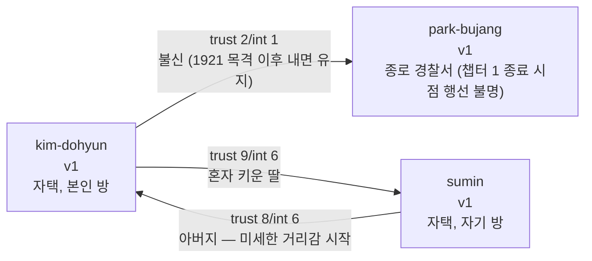

# 인물 관계도 — 챕터 1

```mermaid
graph LR
  kim-dohyun["kim-dohyun<br/>v1<br/>자택, 본인 방"]
  sumin["sumin<br/>v1<br/>자택, 자기 방"]
  park-bujang["park-bujang<br/>v1<br/>종로 경찰서 (챕터 1 종료 시점 행선 불명)"]
  kim-dohyun -- "trust 2/int 1<br/>불신 (1921 목격 이후 내면 유지)" --> park-bujang
  kim-dohyun -- "trust 9/int 6<br/>혼자 키운 딸" --> sumin
  sumin -- "trust 8/int 6<br/>아버지 — 미세한 거리감 시작" --> kim-dohyun
```
