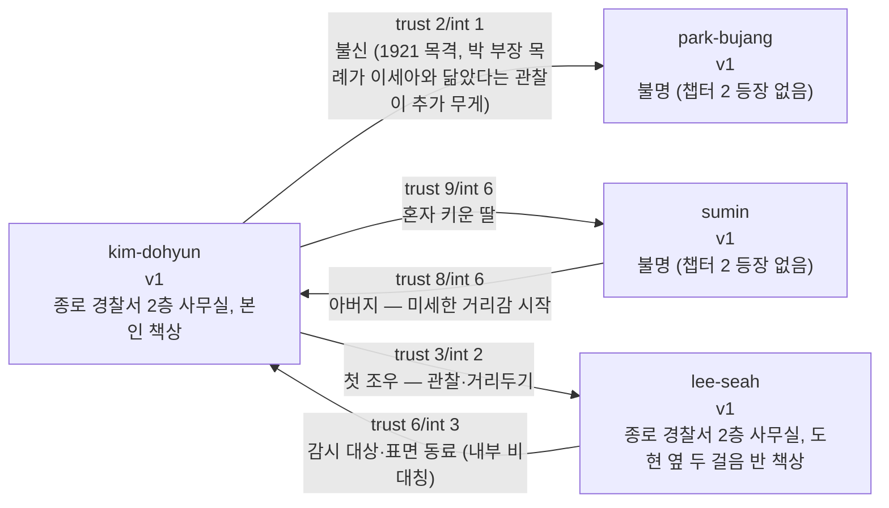

# 인물 관계도 — 챕터 2

```mermaid
graph LR
  kim-dohyun["kim-dohyun<br/>v1<br/>종로 경찰서 2층 사무실, 본인 책상"]
  lee-seah["lee-seah<br/>v1<br/>종로 경찰서 2층 사무실, 도현 옆 두 걸음 반 책상"]
  park-bujang["park-bujang<br/>v1<br/>불명 (챕터 2 등장 없음)"]
  sumin["sumin<br/>v1<br/>불명 (챕터 2 등장 없음)"]
  kim-dohyun -- "trust 2/int 1<br/>불신 (1921 목격, 박 부장 목례가 이세아와 닮았다는 관찰이 추가 무게)" --> park-bujang
  kim-dohyun -- "trust 9/int 6<br/>혼자 키운 딸" --> sumin
  sumin -- "trust 8/int 6<br/>아버지 — 미세한 거리감 시작" --> kim-dohyun
  kim-dohyun -- "trust 3/int 2<br/>첫 조우 — 관찰·거리두기" --> lee-seah
  lee-seah -- "trust 6/int 3<br/>감시 대상·표면 동료 (내부 비대칭)" --> kim-dohyun
```
