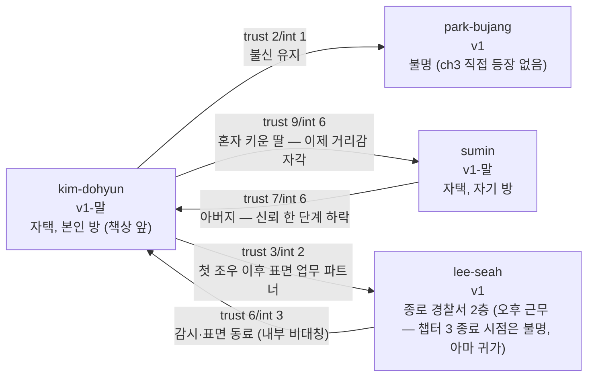

# 인물 관계도 — 챕터 3

```mermaid
graph LR
  kim-dohyun["kim-dohyun<br/>v1-말<br/>자택, 본인 방 (책상 앞)"]
  sumin["sumin<br/>v1-말<br/>자택, 자기 방"]
  lee-seah["lee-seah<br/>v1<br/>종로 경찰서 2층 (오후 근무 — 챕터 3 종료 시점은 불명, 아마 귀가)"]
  park-bujang["park-bujang<br/>v1<br/>불명 (ch3 직접 등장 없음)"]
  kim-dohyun -- "trust 2/int 1<br/>불신 유지" --> park-bujang
  kim-dohyun -- "trust 9/int 6<br/>혼자 키운 딸 — 이제 거리감 자각" --> sumin
  sumin -- "trust 7/int 6<br/>아버지 — 신뢰 한 단계 하락" --> kim-dohyun
  kim-dohyun -- "trust 3/int 2<br/>첫 조우 이후 표면 업무 파트너" --> lee-seah
  lee-seah -- "trust 6/int 3<br/>감시·표면 동료 (내부 비대칭)" --> kim-dohyun
```
