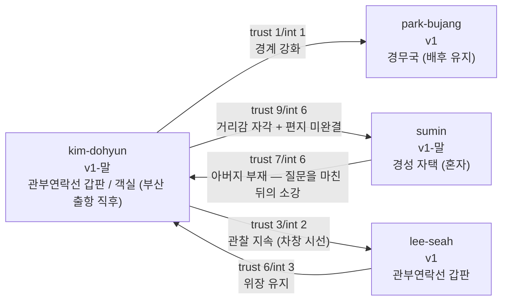

# 인물 관계도 — 챕터 4

```mermaid
graph LR
  kim-dohyun["kim-dohyun<br/>v1-말<br/>관부연락선 갑판 / 객실 (부산 출항 직후)"]
  lee-seah["lee-seah<br/>v1<br/>관부연락선 갑판"]
  park-bujang["park-bujang<br/>v1<br/>경무국 (배후 유지)"]
  sumin["sumin<br/>v1-말<br/>경성 자택 (혼자)"]
  kim-dohyun -- "trust 1/int 1<br/>경계 강화" --> park-bujang
  kim-dohyun -- "trust 9/int 6<br/>거리감 자각 + 편지 미완결" --> sumin
  sumin -- "trust 7/int 6<br/>아버지 부재 — 질문을 마친 뒤의 소강" --> kim-dohyun
  kim-dohyun -- "trust 3/int 2<br/>관찰 지속 (차창 시선)" --> lee-seah
  lee-seah -- "trust 6/int 3<br/>위장 유지" --> kim-dohyun
```
