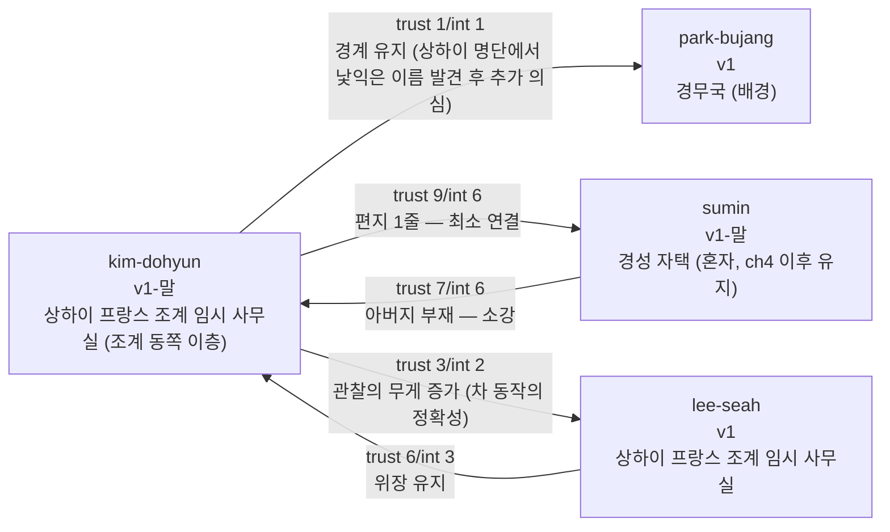

# 인물 관계도 — 챕터 5

```mermaid
graph LR
  kim-dohyun["kim-dohyun<br/>v1-말<br/>상하이 프랑스 조계 임시 사무실 (조계 동쪽 이층)"]
  lee-seah["lee-seah<br/>v1<br/>상하이 프랑스 조계 임시 사무실"]
  park-bujang["park-bujang<br/>v1<br/>경무국 (배경)"]
  sumin["sumin<br/>v1-말<br/>경성 자택 (혼자, ch4 이후 유지)"]
  kim-dohyun -- "trust 1/int 1<br/>경계 유지 (상하이 명단에서 낯익은 이름 발견 후 추가 의심)" --> park-bujang
  kim-dohyun -- "trust 9/int 6<br/>편지 1줄 — 최소 연결" --> sumin
  sumin -- "trust 7/int 6<br/>아버지 부재 — 소강" --> kim-dohyun
  kim-dohyun -- "trust 3/int 2<br/>관찰의 무게 증가 (차 동작의 정확성)" --> lee-seah
  lee-seah -- "trust 6/int 3<br/>위장 유지" --> kim-dohyun
```
