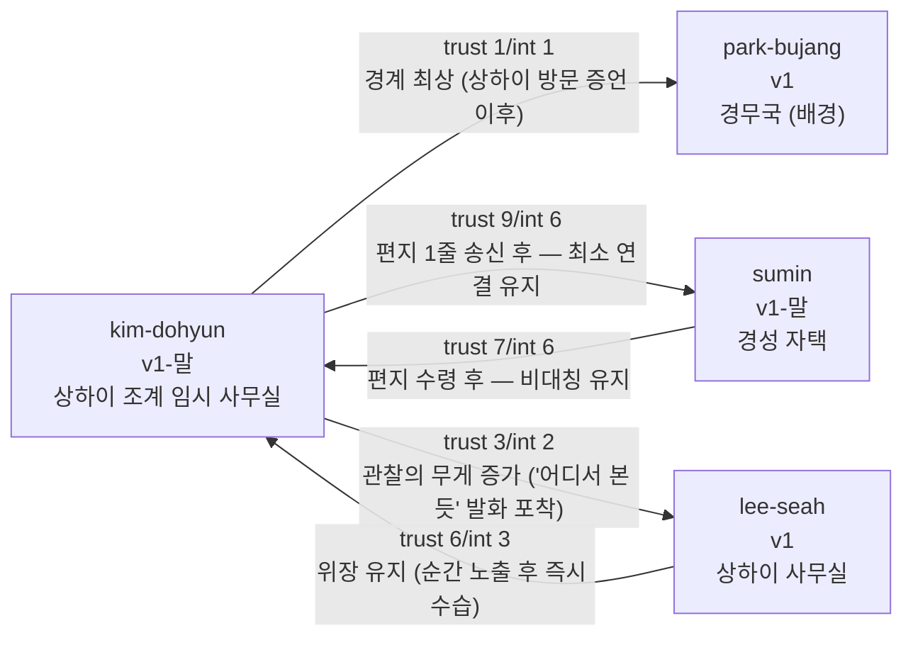

# 인물 관계도 — 챕터 6

```mermaid
graph LR
  kim-dohyun["kim-dohyun<br/>v1-말<br/>상하이 조계 임시 사무실"]
  lee-seah["lee-seah<br/>v1<br/>상하이 사무실"]
  park-bujang["park-bujang<br/>v1<br/>경무국 (배경)"]
  sumin["sumin<br/>v1-말<br/>경성 자택"]
  kim-dohyun -- "trust 1/int 1<br/>경계 최상 (상하이 방문 증언 이후)" --> park-bujang
  kim-dohyun -- "trust 9/int 6<br/>편지 1줄 송신 후 — 최소 연결 유지" --> sumin
  sumin -- "trust 7/int 6<br/>편지 수령 후 — 비대칭 유지" --> kim-dohyun
  kim-dohyun -- "trust 3/int 2<br/>관찰의 무게 증가 ('어디서 본 듯' 발화 포착)" --> lee-seah
  lee-seah -- "trust 6/int 3<br/>위장 유지 (순간 노출 후 즉시 수습)" --> kim-dohyun
```
