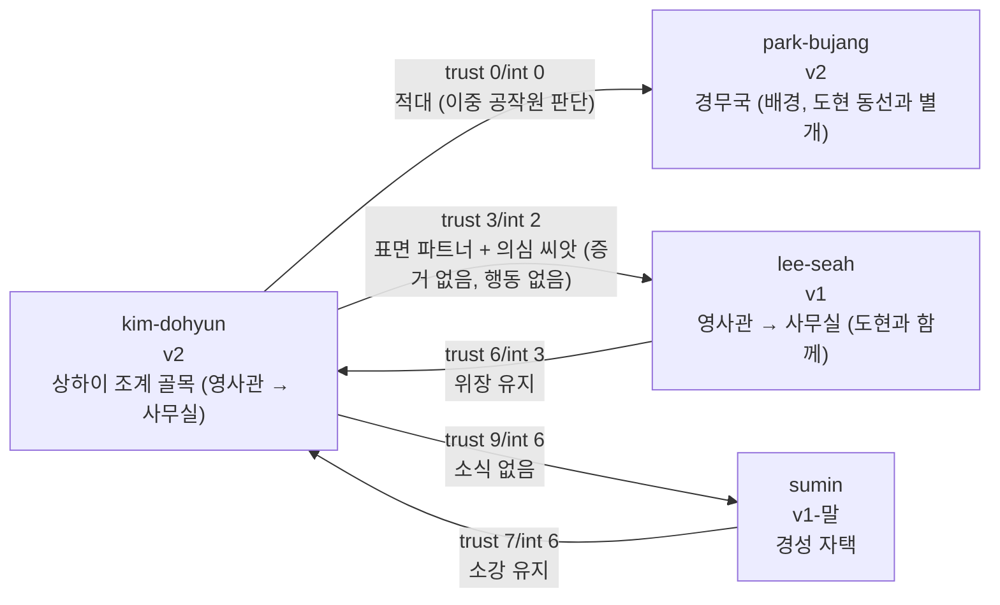

# 인물 관계도 — 챕터 7

```mermaid
graph LR
  kim-dohyun["kim-dohyun<br/>v2<br/>상하이 조계 골목 (영사관 → 사무실)"]
  lee-seah["lee-seah<br/>v1<br/>영사관 → 사무실 (도현과 함께)"]
  park-bujang["park-bujang<br/>v2<br/>경무국 (배경, 도현 동선과 별개)"]
  sumin["sumin<br/>v1-말<br/>경성 자택"]
  kim-dohyun -- "trust 0/int 0<br/>적대 (이중 공작원 판단)" --> park-bujang
  kim-dohyun -- "trust 3/int 2<br/>표면 파트너 + 의심 씨앗 (증거 없음, 행동 없음)" --> lee-seah
  lee-seah -- "trust 6/int 3<br/>위장 유지" --> kim-dohyun
  kim-dohyun -- "trust 9/int 6<br/>소식 없음" --> sumin
  sumin -- "trust 7/int 6<br/>소강 유지" --> kim-dohyun
```
