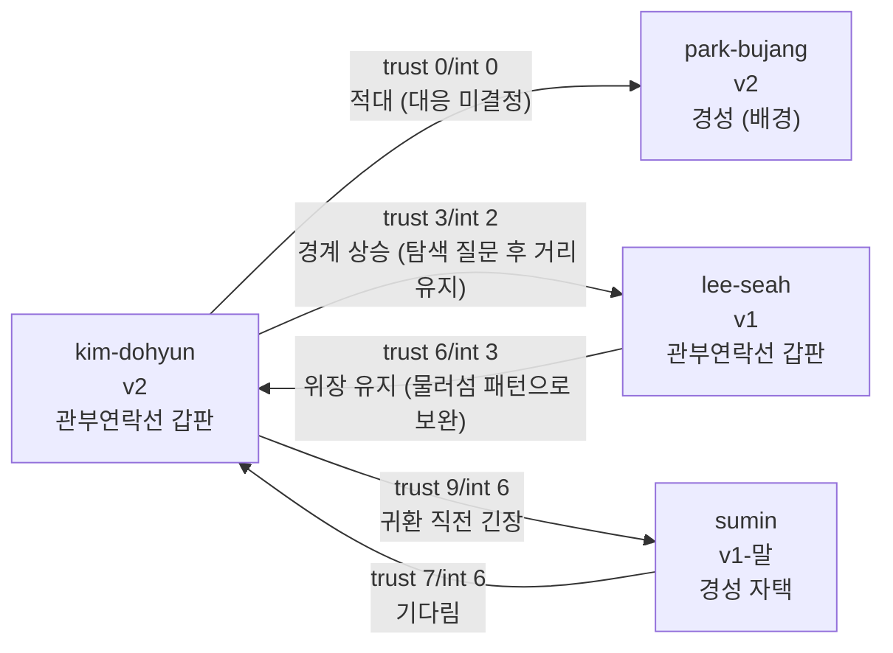

# 인물 관계도 — 챕터 8

```mermaid
graph LR
  kim-dohyun["kim-dohyun<br/>v2<br/>관부연락선 갑판"]
  lee-seah["lee-seah<br/>v1<br/>관부연락선 갑판"]
  park-bujang["park-bujang<br/>v2<br/>경성 (배경)"]
  sumin["sumin<br/>v1-말<br/>경성 자택"]
  kim-dohyun -- "trust 0/int 0<br/>적대 (대응 미결정)" --> park-bujang
  kim-dohyun -- "trust 3/int 2<br/>경계 상승 (탐색 질문 후 거리 유지)" --> lee-seah
  lee-seah -- "trust 6/int 3<br/>위장 유지 (물러섬 패턴으로 보완)" --> kim-dohyun
  kim-dohyun -- "trust 9/int 6<br/>귀환 직전 긴장" --> sumin
  sumin -- "trust 7/int 6<br/>기다림" --> kim-dohyun
```
