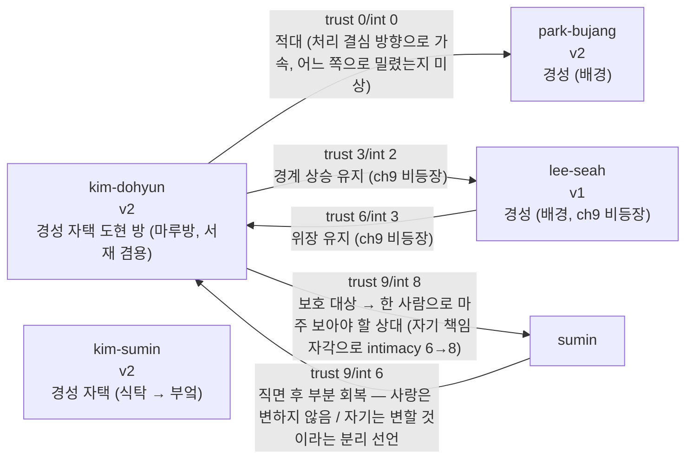

# 인물 관계도 — 챕터 9

```mermaid
graph LR
  kim-dohyun["kim-dohyun<br/>v2<br/>경성 자택 도현 방 (마루방, 서재 겸용)"]
  kim-sumin["kim-sumin<br/>v2<br/>경성 자택 (식탁 → 부엌)"]
  park-bujang["park-bujang<br/>v2<br/>경성 (배경)"]
  lee-seah["lee-seah<br/>v1<br/>경성 (배경, ch9 비등장)"]
  kim-dohyun -- "trust 0/int 0<br/>적대 (처리 결심 방향으로 가속, 어느 쪽으로 밀렸는지 미상)" --> park-bujang
  kim-dohyun -- "trust 3/int 2<br/>경계 상승 유지 (ch9 비등장)" --> lee-seah
  lee-seah -- "trust 6/int 3<br/>위장 유지 (ch9 비등장)" --> kim-dohyun
  kim-dohyun -- "trust 9/int 8<br/>보호 대상 → 한 사람으로 마주 보아야 할 상대 (자기 책임 자각으로 intimacy 6→8)" --> sumin
  sumin -- "trust 9/int 6<br/>직면 후 부분 회복 — 사랑은 변하지 않음 / 자기는 변할 것이라는 분리 선언" --> kim-dohyun
```
