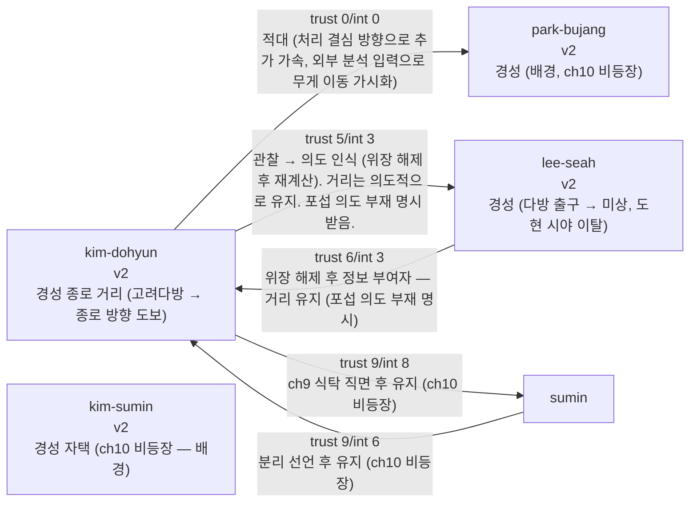

# 인물 관계도 — 챕터 10

```mermaid
graph LR
  kim-dohyun["kim-dohyun<br/>v2<br/>경성 종로 거리 (고려다방 → 종로 방향 도보)"]
  lee-seah["lee-seah<br/>v2<br/>경성 (다방 출구 → 미상, 도현 시야 이탈)"]
  park-bujang["park-bujang<br/>v2<br/>경성 (배경, ch10 비등장)"]
  kim-sumin["kim-sumin<br/>v2<br/>경성 자택 (ch10 비등장 — 배경)"]
  kim-dohyun -- "trust 0/int 0<br/>적대 (처리 결심 방향으로 추가 가속, 외부 분석 입력으로 무게 이동 가시화)" --> park-bujang
  kim-dohyun -- "trust 5/int 3<br/>관찰 → 의도 인식 (위장 해제 후 재계산). 거리는 의도적으로 유지. 포섭 의도 부재 명시 받음." --> lee-seah
  lee-seah -- "trust 6/int 3<br/>위장 해제 후 정보 부여자 — 거리 유지 (포섭 의도 부재 명시)" --> kim-dohyun
  kim-dohyun -- "trust 9/int 8<br/>ch9 식탁 직면 후 유지 (ch10 비등장)" --> sumin
  sumin -- "trust 9/int 6<br/>분리 선언 후 유지 (ch10 비등장)" --> kim-dohyun
```
