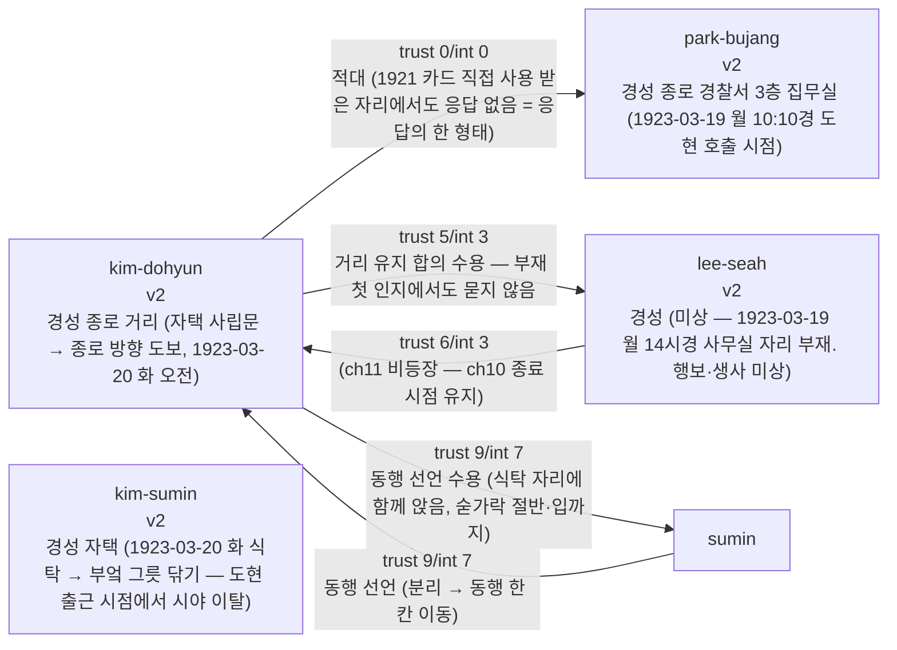

# 인물 관계도 — 챕터 11

```mermaid
graph LR
  kim-dohyun["kim-dohyun<br/>v2<br/>경성 종로 거리 (자택 사립문 → 종로 방향 도보, 1923-03-20 화 오전)"]
  kim-sumin["kim-sumin<br/>v2<br/>경성 자택 (1923-03-20 화 식탁 → 부엌 그릇 닦기 — 도현 출근 시점에서 시야 이탈)"]
  park-bujang["park-bujang<br/>v2<br/>경성 종로 경찰서 3층 집무실 (1923-03-19 월 10:10경 도현 호출 시점)"]
  lee-seah["lee-seah<br/>v2<br/>경성 (미상 — 1923-03-19 월 14시경 사무실 자리 부재. 행보·생사 미상)"]
  kim-dohyun -- "trust 0/int 0<br/>적대 (1921 카드 직접 사용 받은 자리에서도 응답 없음 = 응답의 한 형태)" --> park-bujang
  kim-dohyun -- "trust 5/int 3<br/>거리 유지 합의 수용 — 부재 첫 인지에서도 묻지 않음" --> lee-seah
  lee-seah -- "trust 6/int 3<br/>(ch11 비등장 — ch10 종료 시점 유지)" --> kim-dohyun
  kim-dohyun -- "trust 9/int 7<br/>동행 선언 수용 (식탁 자리에 함께 앉음, 숟가락 절반·입까지)" --> sumin
  sumin -- "trust 9/int 7<br/>동행 선언 (분리 → 동행 한 칸 이동)" --> kim-dohyun
```
