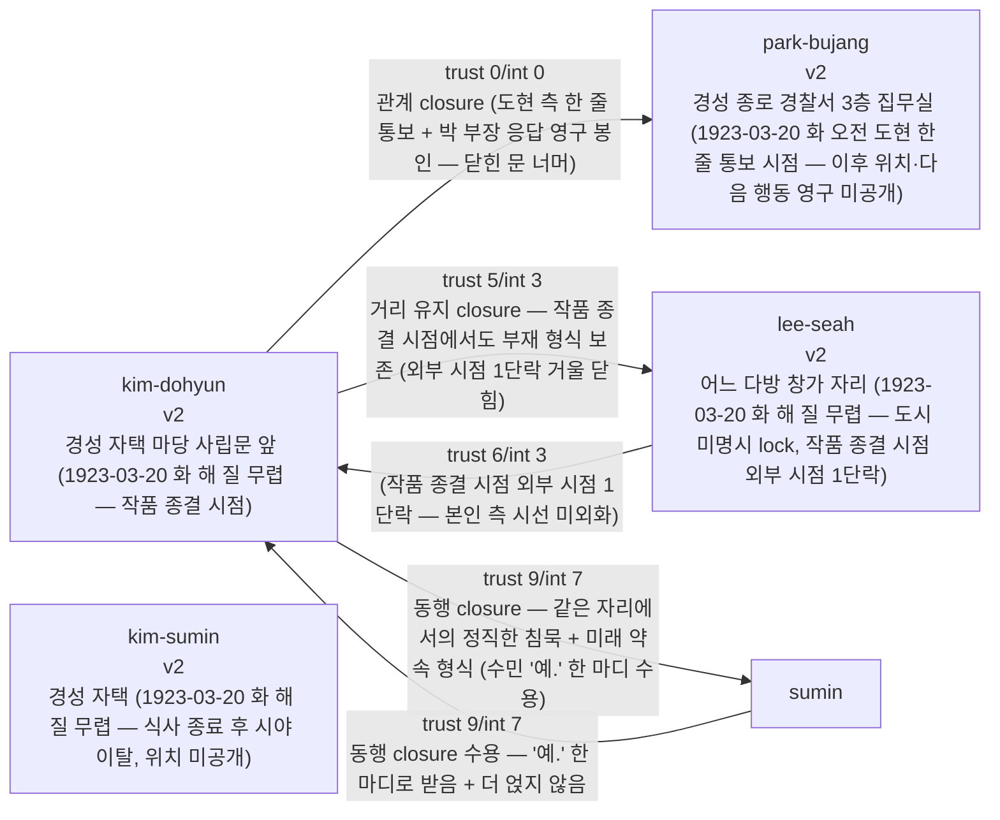

# 인물 관계도 — 챕터 12

```mermaid
graph LR
  kim-dohyun["kim-dohyun<br/>v2<br/>경성 자택 마당 사립문 앞 (1923-03-20 화 해 질 무렵 — 작품 종결 시점)"]
  kim-sumin["kim-sumin<br/>v2<br/>경성 자택 (1923-03-20 화 해 질 무렵 — 식사 종료 후 시야 이탈, 위치 미공개)"]
  park-bujang["park-bujang<br/>v2<br/>경성 종로 경찰서 3층 집무실 (1923-03-20 화 오전 도현 한 줄 통보 시점 — 이후 위치·다음 행동 영구 미공개)"]
  lee-seah["lee-seah<br/>v2<br/>어느 다방 창가 자리 (1923-03-20 화 해 질 무렵 — 도시 미명시 lock, 작품 종결 시점 외부 시점 1단락)"]
  kim-dohyun -- "trust 0/int 0<br/>관계 closure (도현 측 한 줄 통보 + 박 부장 응답 영구 봉인 — 닫힌 문 너머)" --> park-bujang
  kim-dohyun -- "trust 5/int 3<br/>거리 유지 closure — 작품 종결 시점에서도 부재 형식 보존 (외부 시점 1단락 거울 닫힘)" --> lee-seah
  lee-seah -- "trust 6/int 3<br/>(작품 종결 시점 외부 시점 1단락 — 본인 측 시선 미외화)" --> kim-dohyun
  kim-dohyun -- "trust 9/int 7<br/>동행 closure — 같은 자리에서의 정직한 침묵 + 미래 약속 형식 (수민 '예.' 한 마디 수용)" --> sumin
  sumin -- "trust 9/int 7<br/>동행 closure 수용 — '예.' 한 마디로 받음 + 더 얹지 않음" --> kim-dohyun
```
