```mermaid
gantt
    title SP-F: 이세아의 시한 압력 경고 (이세아 부재 응답)
    dateFormat X
    axisFormat ch%s
    section open
    ch10 진행 :10, 1
    section open
    ch11 진행 :11, 1
    section closed
    ch12 진행 :12, 1
```

# 서브플롯 (SP) 추적도

## SP-A — 박 부장의 실제 공작

| 챕터 | status | last_hinted | payoff |
|------|--------|-------------|--------|
| ch01 | open | ch1 | ch7 |
| ch02 | open | ch2 | ch7 |
| ch03 | open | ch2 | ch7 |
| ch04 | open | ch4 | ch7 |
| ch05 | open | ch5 | ch7 |
| ch06 | open | ch6 | ch7 |
| ch07 | partial | ch7 | ch12 |
| ch08 | partial | ch7 | ch12 |
| ch09 | partial | ch9 | ch12 |
| ch10 | partial | ch10 | ch12 |
| ch11 | partial | ch11 | ch12 |
| ch12 | closed | ch12 | ch12 |

```mermaid
gantt
    title SP-A: 박 부장의 실제 공작
    dateFormat X
    axisFormat ch%s
    section open
    ch01 진행 :1, 1
    section open
    ch02 진행 :2, 1
    section open
    ch03 진행 :3, 1
    section open
    ch04 진행 :4, 1
    section open
    ch05 진행 :5, 1
    section open
    ch06 진행 :6, 1
    section partial
    ch07 진행 :7, 1
    section partial
    ch08 진행 :8, 1
    section partial
    ch09 진행 :9, 1
    section partial
    ch10 진행 :10, 1
    section partial
    ch11 진행 :11, 1
    section closed
    ch12 진행 :12, 1
```

## SP-B — 이세아의 정체

| 챕터 | status | last_hinted | payoff |
|------|--------|-------------|--------|
| ch01 | open | ch1 | ch10 |
| ch02 | open | ch2 | ch10 |
| ch03 | open | ch2 | ch10 |
| ch04 | open | ch4 | ch10 |
| ch05 | open | ch5 | ch10 |
| ch06 | open | ch6 | ch10 |
| ch07 | open | ch7 | ch10 |
| ch08 | open | ch8 | ch10 |
| ch09 | open | ch8 | ch10 |
| ch10 | closed | ch10 | ch10 |
| ch11 | closed | ch10 | ch10 |
| ch12 | closed | ch10 | ch10 |

```mermaid
gantt
    title SP-B: 이세아의 정체
    dateFormat X
    axisFormat ch%s
    section open
    ch01 진행 :1, 1
    section open
    ch02 진행 :2, 1
    section open
    ch03 진행 :3, 1
    section open
    ch04 진행 :4, 1
    section open
    ch05 진행 :5, 1
    section open
    ch06 진행 :6, 1
    section open
    ch07 진행 :7, 1
    section open
    ch08 진행 :8, 1
    section open
    ch09 진행 :9, 1
    section closed
    ch10 진행 :10, 1
    section closed
    ch11 진행 :11, 1
    section closed
    ch12 진행 :12, 1
```

## SP-C — 수민의 의심

| 챕터 | status | last_hinted | payoff |
|------|--------|-------------|--------|
| ch01 | open | ch1 | ch9 |
| ch02 | open | ch1 | ch9 |
| ch03 | partial | ch3 | ch9 |
| ch04 | partial | ch3 | ch9 |
| ch05 | partial | ch3 | ch9 |
| ch06 | partial | ch3 | ch9 |
| ch07 | partial | ch3 | ch9 |
| ch08 | partial | ch3 | ch9 |
| ch09 | partial | ch9 | ch12 |
| ch10 | partial | ch9 | ch12 |
| ch11 | partial | ch11 | ch12 |
| ch12 | closed | ch12 | ch12 |

```mermaid
gantt
    title SP-C: 수민의 의심
    dateFormat X
    axisFormat ch%s
    section open
    ch01 진행 :1, 1
    section open
    ch02 진행 :2, 1
    section partial
    ch03 진행 :3, 1
    section partial
    ch04 진행 :4, 1
    section partial
    ch05 진행 :5, 1
    section partial
    ch06 진행 :6, 1
    section partial
    ch07 진행 :7, 1
    section partial
    ch08 진행 :8, 1
    section partial
    ch09 진행 :9, 1
    section partial
    ch10 진행 :10, 1
    section partial
    ch11 진행 :11, 1
    section closed
    ch12 진행 :12, 1
```

## SP-D — 도현 결심의 방향

| 챕터 | status | last_hinted | payoff |
|------|--------|-------------|--------|
| ch09 | open | ch9 | ch10 |
| ch10 | open | ch10 | ch12 |
| ch11 | open | ch11 | ch12 |
| ch12 | closed | ch12 | ch12 |

```mermaid
gantt
    title SP-D: 도현 결심의 방향
    dateFormat X
    axisFormat ch%s
    section open
    ch09 진행 :9, 1
    section open
    ch10 진행 :10, 1
    section open
    ch11 진행 :11, 1
    section closed
    ch12 진행 :12, 1
```

## SP-E — 이웃 마당 양철 물소리

| 챕터 | status | last_hinted | payoff |
|------|--------|-------------|--------|
| ch09 | open | ch9 | ch10 |
| ch10 | closed | ch10 | ch10 |
| ch11 | closed | ch10 | ch10 |
| ch12 | closed | ch12 | ch10 |

```mermaid
gantt
    title SP-E: 이웃 마당 양철 물소리
    dateFormat X
    axisFormat ch%s
    section open
    ch09 진행 :9, 1
    section closed
    ch10 진행 :10, 1
    section closed
    ch11 진행 :11, 1
    section closed
    ch12 진행 :12, 1
```

## SP-F — 이세아의 시한 압력 경고 (이세아 부재 응답)

| 챕터 | status | last_hinted | payoff |
|------|--------|-------------|--------|
| ch10 | open | ch10 | ch12 |
| ch11 | open | ch11 | ch12 |
| ch12 | closed | ch12 | ch12 |

