# 서브플롯 (SP) 추적도

## SP-A — 박 부장의 실제 공작

| 챕터 | status | last_hinted | payoff |
|------|--------|-------------|--------|
| ch01 | open | ch1 | ch7 |
| ch02 | open | ch2 | ch7 |
| ch03 | open | ch2 | ch7 |
| ch04 | open | ch4 | ch7 |
| ch05 | open | ch5 | ch7 |
| ch06 | open | ch6 | ch7 |
| ch07 | partial | ch7 | ch12 |
| ch08 | partial | ch7 | ch12 |

```mermaid
gantt
    title SP-A: 박 부장의 실제 공작
    dateFormat X
    axisFormat ch%s
    section open
    ch01 진행 :1, 1
    section open
    ch02 진행 :2, 1
    section open
    ch03 진행 :3, 1
    section open
    ch04 진행 :4, 1
    section open
    ch05 진행 :5, 1
    section open
    ch06 진행 :6, 1
    section partial
    ch07 진행 :7, 1
    section partial
    ch08 진행 :8, 1
```

## SP-B — 이세아의 정체

| 챕터 | status | last_hinted | payoff |
|------|--------|-------------|--------|
| ch01 | open | ch1 | ch10 |
| ch02 | open | ch2 | ch10 |
| ch03 | open | ch2 | ch10 |
| ch04 | open | ch4 | ch10 |
| ch05 | open | ch5 | ch10 |
| ch06 | open | ch6 | ch10 |
| ch07 | open | ch7 | ch10 |
| ch08 | open | ch8 | ch10 |

```mermaid
gantt
    title SP-B: 이세아의 정체
    dateFormat X
    axisFormat ch%s
    section open
    ch01 진행 :1, 1
    section open
    ch02 진행 :2, 1
    section open
    ch03 진행 :3, 1
    section open
    ch04 진행 :4, 1
    section open
    ch05 진행 :5, 1
    section open
    ch06 진행 :6, 1
    section open
    ch07 진행 :7, 1
    section open
    ch08 진행 :8, 1
```

## SP-C — 수민의 의심

| 챕터 | status | last_hinted | payoff |
|------|--------|-------------|--------|
| ch01 | open | ch1 | ch9 |
| ch02 | open | ch1 | ch9 |
| ch03 | partial | ch3 | ch9 |
| ch04 | partial | ch3 | ch9 |
| ch05 | partial | ch3 | ch9 |
| ch06 | partial | ch3 | ch9 |
| ch07 | partial | ch3 | ch9 |
| ch08 | partial | ch3 | ch9 |

```mermaid
gantt
    title SP-C: 수민의 의심
    dateFormat X
    axisFormat ch%s
    section open
    ch01 진행 :1, 1
    section open
    ch02 진행 :2, 1
    section partial
    ch03 진행 :3, 1
    section partial
    ch04 진행 :4, 1
    section partial
    ch05 진행 :5, 1
    section partial
    ch06 진행 :6, 1
    section partial
    ch07 진행 :7, 1
    section partial
    ch08 진행 :8, 1
```

